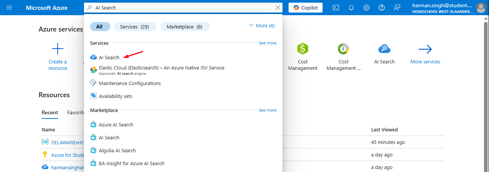
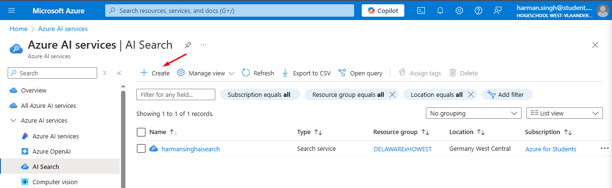
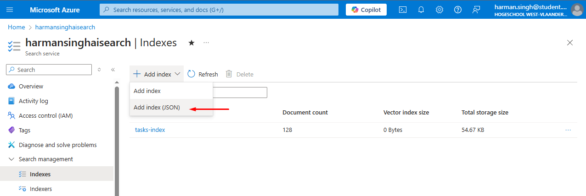

# Creating the `AI Search` resource on Azure

Get started by navigating to the Azure Portal (<https://portal.azure.com>), and log into your account.

## Steps

Search for "AI Search" in the search bar, and click on the "AI Search" option under the 'Services' section.

This will bring you to a screen that shows you all AI Search services linked to your account

Press the `+ Create` button to create a new AI Search service

This will bring you to a screen where you need to fill in some details about your AI Search service. Here is how you proceed:

- `Subscription`: select the subscription you want to use in the drop-down list
- `Resource group`: select the resource group you want to add the AI Search service to
- `Service name`: choose a name for the AI Search service
- `Location` (**important!!**): choose your region. This is a very important choice, because it affects your estimated cost quite a lot (and also how much storage you get). Choosing the wrong location will be a costly mistake, so make sure to choose the correct one.
- `Pricing tier`: press the blue text saying `Change pricing tier` so you see all available pricing tiers. Pick the one you think fits best. You can start off with the free tier and upgrade later if needed

Press `Next: Scale` to go the next screen where you can play around with the amount of replicas and partitions. Change these according to what your company requires. Proceed by pressing `Next: Networking` and choose either Public or Private. Followed by pressing `Next: Tags`, which you can leave empty

After this press `Next: Review + create` to create the resource, and then the blue `Create` button on the next screen to actually make the resource.

Wait for the deployment to complete.

## After creating the resource

After creating the resource you need to create an index which will contain the knowledge base's data. To do this follow these steps:

1. Navigate to the Azure portal
2. Search for the `Search service` resource you just made, and click on it
3. Under "Search management", click on **"Indexes"** (not "Indexers")
4. Press `+ Add index`, and choose the option with (JSON) at the end (see photo)

<!-- markdownlint-disable MD029 -->
5. Delete the contents in the code-field so that the code-field is empty. Then paste the contents of the `index-json-configuration-file.json` file there instead. You can find this file in this directory (it's the file ending on `.json`)

Pressing the blue `Save` button should create the index and you should see it in the list.
