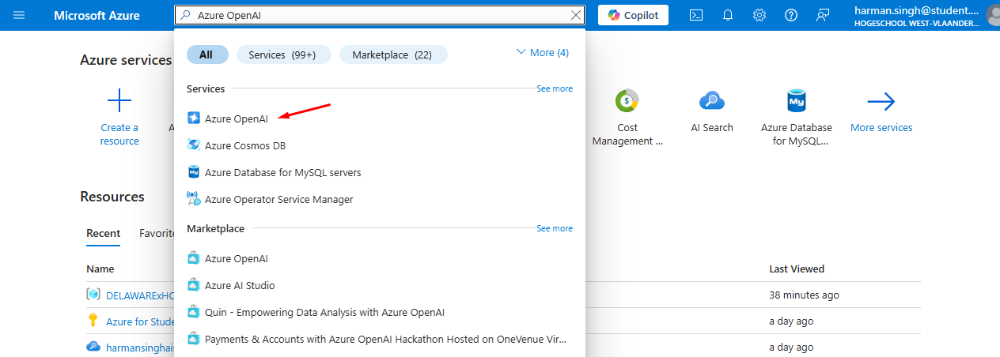
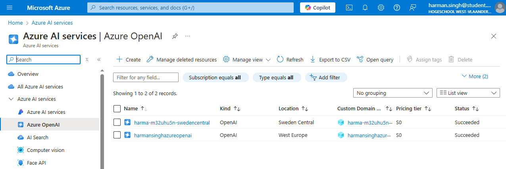

# Creating the `Azure OpenAI` resource on Azure

Get started by navigating to the Azure Portal (<https://portal.azure.com>), and log into your account.

## Steps

Search for "Azure OpenAI" in the search bar, and click on the "Azure OpenAI" option under the 'Services' section.

This will bring you to a screen that shows you all Azure OpenAI services linked to your account

Press the `+ Create` button to create a new Azure OpenAI service

This will bring you to a screen where you need to fill in some details about your Azure OpenAI service. Here is how you proceed:

- `Subscription`: select the subscription you want to use in the drop-down list
- `Resource group`: select the resource group you want to add the Azure OpenAI service to
- `Region`: choose your region, or leave as default
- `Name`: choose a name for the Azure OpenAI service
- `Pricing tier`: at the time of writing this guide only 1 option is available, namely "Standard S0", so we picked that one

Press the blue `Next` to continue to the next step of the configuration. You will be asked which type of network security you would like for your Azure AI services resource. This is something decided internally in the company, but we went for "All networks, including the internet, can access this resource"

After this press the blue `Next` to get to the screen with Tags, simply ignore this section, and press the blue `Next` again. And then the blue `Create` button on the next screen to actually make the resource.

Wait for the deployment to complete.
