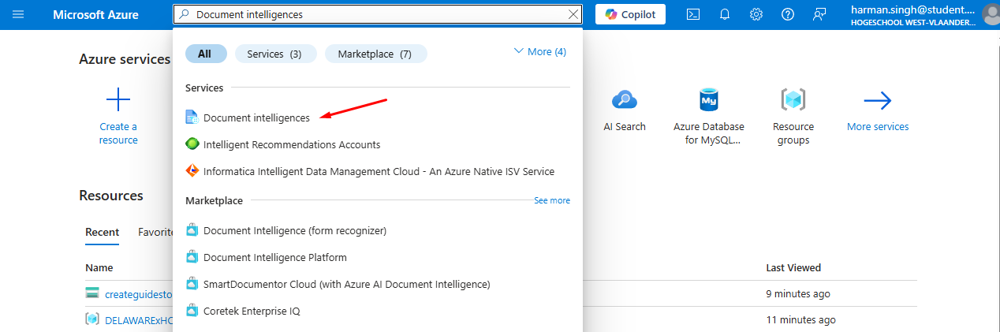
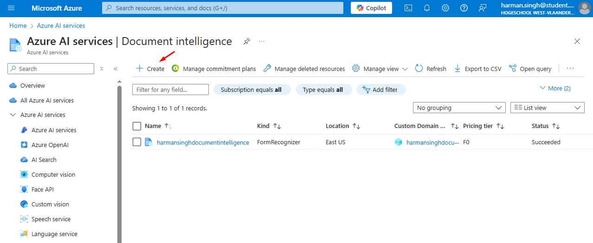
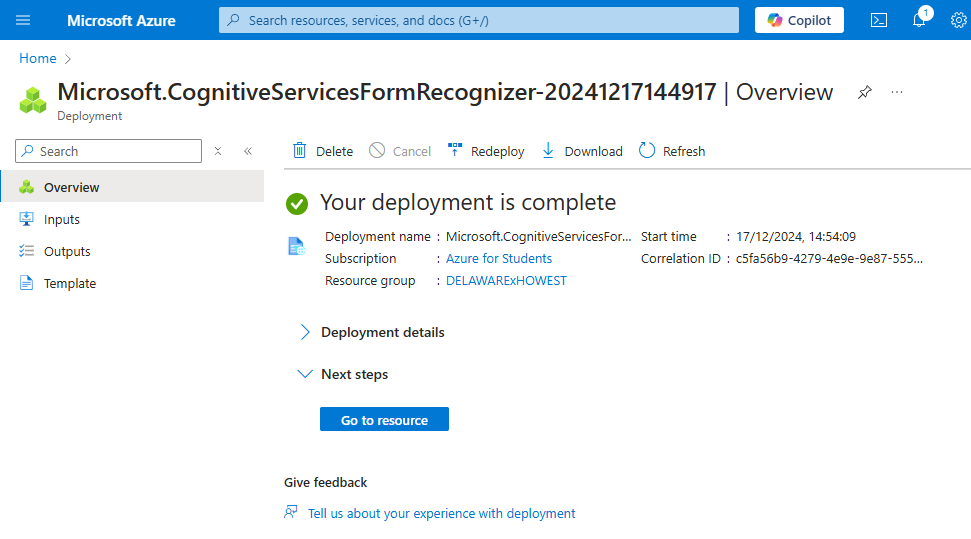

# Creating the `Document intelligence` resource on Azure

Get started by navigating to the Azure Portal (<https://portal.azure.com>), and log into your account.

## Steps

Search for "Document intelligences" in the search bar, and click on the "Document intelligences" option under the 'Services' section.

This will bring you to a screen that shows you all document intelligence services linked to your account

Press the `+ Create` button to create a new document intelligence service

This will bring you to a screen where you need to fill in some details about your document intelligence service. Here is how you proceed:

- `Subscription`: select the subscription you want to use in the drop-down list
- `Resource group`: select the resource group you want to add the document intelligence service to
- `Region`: choose your region, or leave as default
- `Name`: choose a name for the document intelligence service
- `Pricing tier`: at the time of writing this guide only 1 option is available, namely "Standard S0 (1 Call per minute for training API)", so we picked that one

You can further configure the resource if you know what you're doing, but that is optional in this case.

After this press the blue `Review + create` to create the resource, and then the blue `Create` button on the next screen to actually make the resource.

Wait for the deployment to complete. Once it's done, you should see this:

