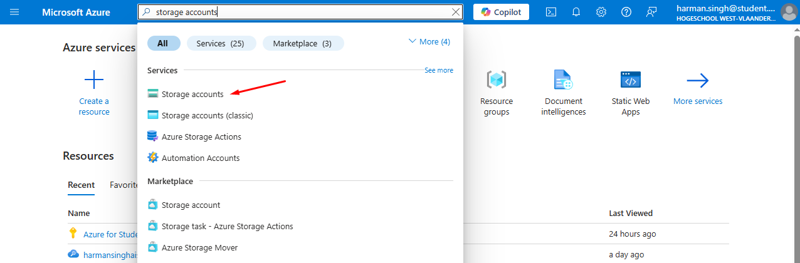
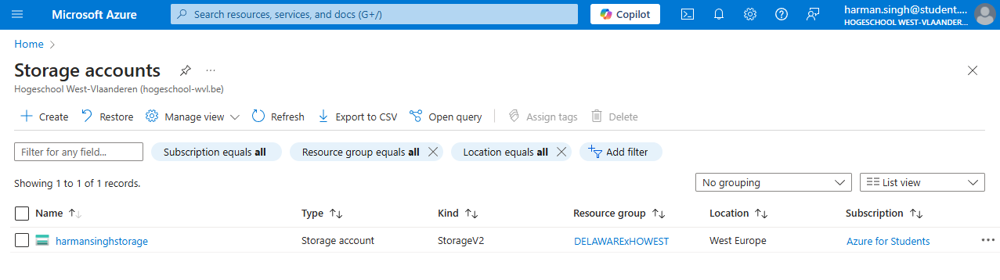
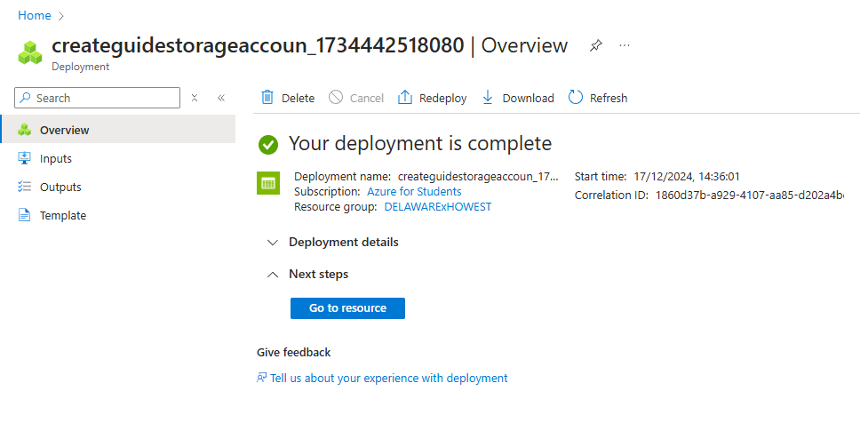

# Creating the `Storage accounts` resource on Azure

Get started by navigating to the Azure Portal (<https://portal.azure.com>), and log into your account.

## Steps

Search for "Storage accounts" in the search bar, and click on the "Storage accounts" option under the 'Services' section

This will bring you to a screen that shows you all storage accounts linked to your account

Press the `+ Create` button to create a new storage account

This will bring you to a screen where you need to fill in some details about your storage account. Here is how you proceed:

- `Subscription`: select the subscription you want to use in the drop-down list
- `Resource group`: select the resource group you want to add the storage account to
- `Storage account name`: choose a name for the storage account
- `Region`: choose your region, or leave as default
- `Primary service`: don't change
- `Performance`: don't change unless necessary
- `Redundancy`: depends on the needs of your company

You can further configure the resource if you know what you're doing, but that is optional in this case.

After this press the blue `Review + create` to create the resource, and then the blue `Create` button on the next screen to actually make the resource.

Wait for the deployment to complete. Once it's done, you should see this:

